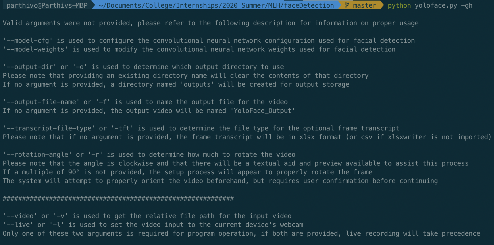

Face detection code for step 1 of Optical Lie Detection

## Installation

You can download the code for this project by executing the following:
```
git clone git@github.com:parthivc/faceDetection.git
```

The prerequisites for the code are as follows
* Tensorflow
* opencv-python
* opencv-contrib-python
* Numpy
* Keras
* Matplotlib
* Pillow

The YoloV3 face detector also requires pre-trained weights files to be locally accessible.
The necessary files can be installed by running the following:
```
pip install -r requirements.txt
sh get_models.sh
```

## Usage

To see the flags and expected values, you can use the flags `-gh`, `--get-help`, or use the built-in `-h` help menu:



The intelligent argument parser performs comprehensive argument checks on each flag and ensures that only valid arguments are provided
* `--model-cfg` changes the YOLO configuration file
* `--model-weights` changes the YOLO weights file
* `--output-dir`, `-o` changes the output directory name
* `--output-file-name`,`-f` changes the output file name
* `--transcript-file-type`, `-tft` changes the file transcript type
    * Checks for invalid arguments; defaults to `xlsx` if `xlsxwriter` is installed and `csv` if it isn't
* `--rotation-angle`, `-r` changes the rotation angle if the input video is not the correct orientation
* `--get-help`, `-gh` displays the help menu

For any file arguments passed through, the pre-execution logic ensures that the files exist and defaults if valid values are not provided
* `--video`, `-v` sets the video input source to the specified file path
    * The video is loaded and processed as a final check, and the program terminates if the video cannot be successfully loaded
* `--live`, `-l` sets the video input source to the on-device camera
    * If the on-device camera is unavailable, the program terminates

If both the `--video` and `--live` flags are passed or neither flag is passed, the `--live` argument takes precedent

## Examples

* `python3 yoloface.py`
    * Runs a live face detection instance
* `python3 yoloface.py -o multiFaceTest -f test1.avi -tft txt -v inputVideos/test1.mov -r 270`
    * Sets the output directory to `multiFaceTest`
    * Sets the output file type to `test1.avi`
    * Sets the transcript file type to `txt`
    * Sets the input video location to `inputVideos/test1.mov`
    * Sets the rotation angle to `270`
